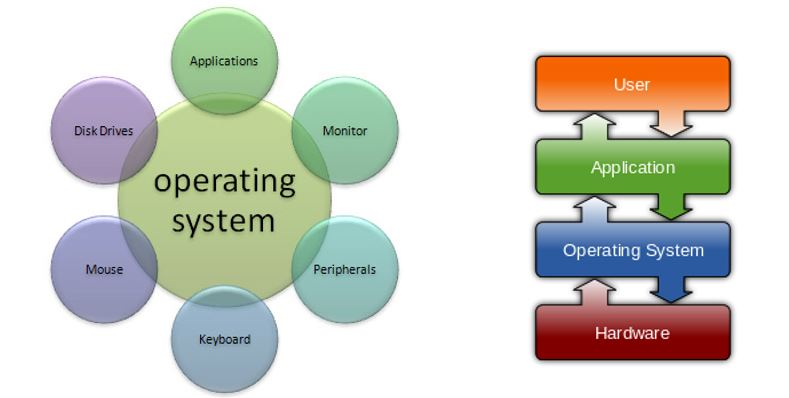

# Introduction

---

## Objectifs

TODO

---

## Définition

Un OS est la couche logicielle qui permet et coordonne l’utilisation du matériel entre les différents programmes d’application.  

!!! tip
    C'est donc le lien entre l'homme et le hardware ! On parle d'IHM - Interface Homme Machine
    

!!! example
    Quelques exemples d'OS :   
        - Unix based : Linux, Mac, Android, iOS ...  
        - Windows : XP, Vista, 7, 10 ...  
        
    

On peut voir l'OS de duex points de vues différents :  

- Utilisateur Lambda : Une IHM  
- Un développeur : Un ensemble d'appels systèmes

---

## Fonctions d'un OS

- Offrir une interface de programmation
- Offrir une interface opérateur conviviale
- Interpréter les commandes et l’enchaînement des travaux    
- Gérer les processus et leur existence simultanée

    - Gestion du processeur  
      Le système doit gérer l'allocation du processeur aux différents programmes pouvant s'exécuter (les processus).   
      Cette allocation se fait par le biais d'un algorithme d'ordonnancement qui  planifie l'exécution des programmes.   
      Selon le type de système d'exploitation, l'algorithme d'ordonnancement répond à des objectifs différents.
      
- Optimiser l’utilisation des éléments du système informatique :

    - Gestion de la concurrence  
      Comme plusieurs programmes coexistent en RAM, ceux-ci peuvent vouloir communiquer pour échanger des données.  
      Par ailleurs, il faut synchroniser l'accès aux données partagées afin de maintenir leur cohérence.   
      Le système offre des outils de communication et de synchronisation entre programmes.

    - Gestion de la mémoire  
      Le système doit gérer l'allocation de la RAM entre les différents programmes pouvant s'exécuter.  
      Comme la mémoire physique est souvent trop petite pour contenir la totalité des programmes, la gestion de la mémoire se fait selon le principe de la mémoire virtuelle.  
      A un instant donné, seules sont chargées en RAM les parties de code et données utiles à l'exécution.

    - Gestion des entrées/sorties  
      Le système doit gérer l'accès aux périphériques, c'est-à-dire faire la liaison entre les appels de haut niveau des programmes utilisateurs (exemple getchar()) et les opérations de bas niveau de l‘unité d’exécution responsable du périphérique (UE clavier)   
      C'est le pilote d'entrées/sorties (driver) qui assure cette correspondance.
      
    - Gestion des objets externes  
      La mémoire centrale est une mémoire volatile (RAM). Aussi, toutes les données devant être conservées au delà de l'arrêt de la machine, doivent être stockées sur une mémoire de masse ( disque dur ).  
      
    - Gestion de l’accès au réseau  
      Le système doit permettre à des exécutions de programmes, placées sur des machines distinctes, de communiquer.  
      Le système offre des outils de type socket pour accéder à la couche de protocoles de communication.
      
    - Gestion de la protection  
      Le système doit fournir des mécanismes garantissant que ses ressources (CPU, mémoire, fichiers,…) ne peuvent être utilisées que par les programmes auxquels les droits nécessaires ont été accordés.
      

        

    