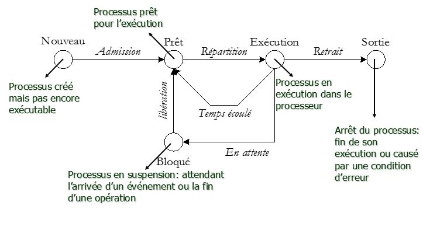

# Processus

---

## Définition

Un processus :  

- Est un programme en cours d'execution.  

    !!! abstract "" 
        C'est donc une ==entité dynamique== !  
        Cela implique qu'il a un **cycle de vie** avec une naissance et une mort, mais aussi qu'il peut interagir avec d'autres processus !

- Interagit par communication

    !!! abstract "" 
        En utilisant le système de communication inter-processus (mémoire partagée, tuyaux/pipes, files de messages, etc.) du SE.

- Utilise des ressources

    !!! abstract "" 
        Ces ressources sont des : fichiers, mémoire, sémaphores périphériques d’E/S, etc.  
        Ces ressources sont contrôlées par le S.E.

---

## Cycle de vie
    

!!! warning
    Si un processus ne respecte pas son cycle de vie, il terminera dans un état "**ZOMBIE**", très néfaste pour la machine hôte ...

---

## Communcication Inter Processus

La communication inter-process est essentielle car elle permet :

- Le transfert des données entre processus

    !!! abstract ""
        Via des "pipes", "memory sharing", "message queue" ou des "signaux"  
        
        Nous nous interesserons particulièrement aux **==Pipes==** : Structure de données **FIFO** dont les accès sont gérés par le S.E
        
        

- La coordination des processus

    !!! abstract ""
        Méthodes qui évitent les erreurs dans l’accès des données et leurs traitements
        

- La synchronisation des processus

    !!! abstract ""
        Appels de système permettant l'ordonancement des processus  

        Nous nous interesserons particulièrement aux fonction `signal()` et `wait()` dans la partie programmation système dee ce cours

Les deux derniers points sont essentiels car ils permettent d'éviter :

- L'impasse

    !!! danger ""
        Interdépendance (de données) des processus qui empêche la progression de tous les processus impliqués  
        ^^Analogie^^: arrêt toutes directions à l’intersection des chemins croisés

        
- La famine

    !!! danger ""
        Interdépendance (de données) des processus qui empêche la progression d’un sous-ensemble de processus impliqués  
        ^^Analogie^^: devant un tourniquet à l’entrée d’un métro à l’heure de pointe

---

## Ordonancement

TODO