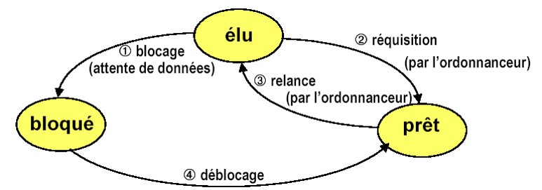
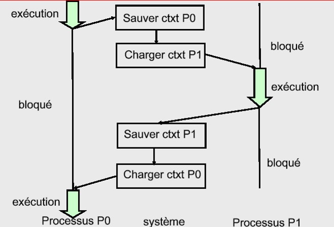
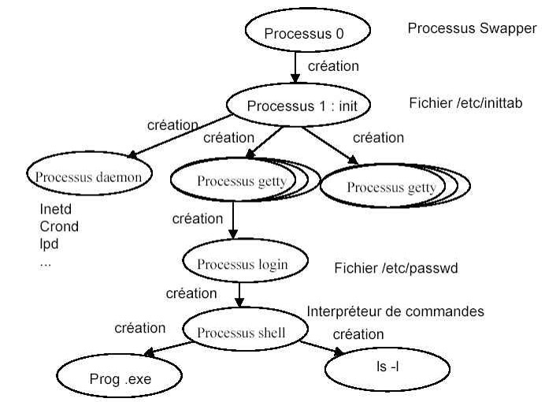
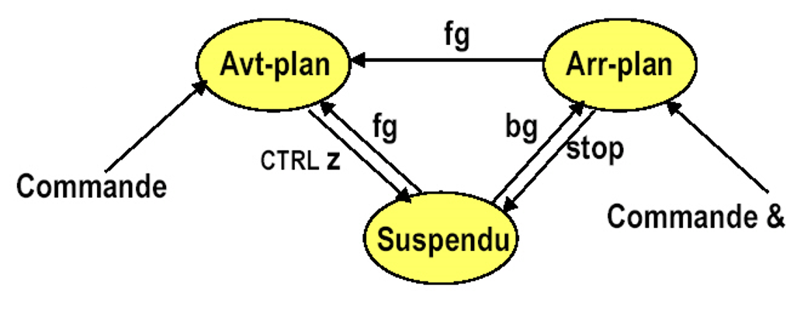
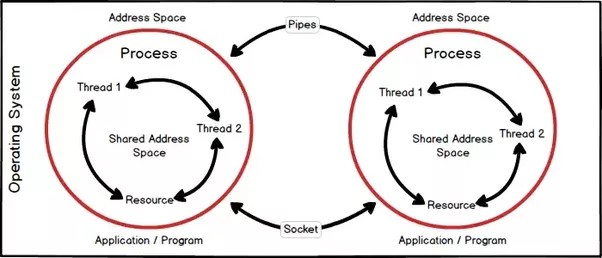

# Processus

---

## Définition

Un processus :  

- Est un programme en cours d'execution.  

    !!! abstract "" 
        C'est donc une ==entité dynamique== !  
        Cela implique qu'il a un **cycle de vie** avec une naissance et une mort, mais aussi qu'il peut interagir avec d'autres processus !


- Interagit par communication

    !!! abstract "" 
        En utilisant le système de communication inter-processus (mémoire partagée, tuyaux/pipes, files de messages, etc.) du SE.


- Utilise des ressources

    !!! abstract "" 
        Ces ressources sont des : fichiers, mémoire, sémaphores périphériques d’E/S, etc.  
        Ces ressources sont contrôlées par le S.E.

---

## Cycle de vie
    


!!! tip
    A la place de "En Execution" on parlera aussi de processus **"Elu"**
    
A un instant donné, un processus peut être dans l’un des états suivants :  

- ^^Actif/Elu^^ : le processus s’exécute sur un processeur (il n’y a donc qu’un seul processus actif en même temps sur une machine monoprocesseur)  
- ^^Prêt^^ : le processus peut devenir actif dès que le processeur lui sera attribué par le système  
- ^^Bloqué^^ : le processus a besoin d’une ressource pour continuer (attente d’entrée/sortie par exemple).  
Le blocage ne peut avoir lieu qu’à la suite d’un appel système. Un processus bloqué ne consomme pas de temps processeur.  
Il peut y en avoir beaucoup sans pénaliser les performances du système.


!!! warning
    Si un processus ne respecte pas son cycle de vie, il terminera dans un état "**ZOMBIE**", très néfaste pour la machine hôte ...

---

## Cycle de vie simplifié



---

## Communcication Inter Processus

La communication inter-process est essentielle car elle permet :

- Le transfert des données entre processus

    !!! abstract ""
        Via des "pipes", "memory sharing", "message queue" ou des "signaux"  
        
        Nous nous interesserons particulièrement aux **==Pipes==** : Structure de données **FIFO** dont les accès sont gérés par le S.E
        
        


- La coordination des processus

    !!! abstract ""
        Méthodes qui évitent les erreurs dans l’accès des données et leurs traitements
        

- La synchronisation des processus

    !!! abstract ""
        Appels de système permettant l'ordonancement des processus  

        Nous nous interesserons particulièrement aux fonction `signal()` et `wait()` dans la partie programmation système dee ce cours


Les deux derniers points sont essentiels car ils permettent d'éviter :

- L'impasse

    !!! danger ""
        Interdépendance (de données) des processus qui empêche la progression de tous les processus impliqués  
        ^^Analogie^^: arrêt toutes directions à l’intersection des chemins croisés

        
- La famine

    !!! danger ""
        Interdépendance (de données) des processus qui empêche la progression d’un sous-ensemble de processus impliqués  
        ^^Analogie^^: devant un tourniquet à l’entrée d’un métro à l’heure de pointe

---

## Table des Processus

Elle formée d’un tableau de structures décrivant les processus, dont le noyau se sert pour gérer leur exécution.  
Chaque entrée dans la table définit un processus crée par le noyau.   

Elle réside en **mémoire**, le noyau l’interroge et la met à jour en permanence lorsqu’il alloue et désalloue du temps CPU aux processus.  
 
Les informations d’ordonnancement de processus de cette table sont aussi mises à jour pour les processus qui ne sont pas en cours d’exécution.  

!!! warning "Important"
    On parle de table ... ce qui implique que chaque processus possède identifiant unique appelé ==**PID**== (Process ID).
    
!!! tip
    Les structures des processus sont définies dans ```/usr/include/sys/proc.h```

---

## Context d'éxecution

Pour pouvoir stopper et reprendre un processus où il en était, le SE doit gérer et conserver/restaurer le context d'execution de chaque processus.



---

## Hierarchie

Comme tout bon système UNIX, et comme pour le SGF, la gestion des processus repose sur un concept ==**arborescent**==.



---

## Modes d'éxecution


### Interactif (foreground)

!!! abstract ""
    Le plus fréquent (on tape une cmd, on attend un résultat)  
    Interruption de la commande par CTRL^C  
    Suspension de la commande par CTRL^Z  

### Arrière plan (background)

!!! abstract ""
    La cmd est lancée, mais on rend le contrôle à l’utilisateur  
    Pas d’interaction avec l’utilisateur.  





---

## Conclusion

!!! success
    Maintenant, votre point de vue de programmeur sur les OS doit ressembler à ceci : 

    

