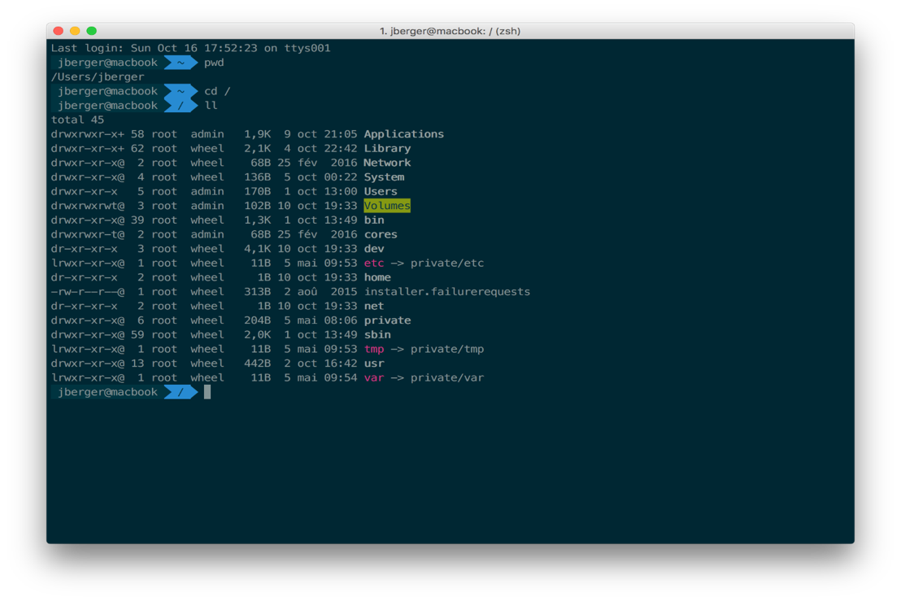

# Pourquoi UNIX ?

---

## Bonnes raisons

- De plus en plus répandu en entreprise
- Incontournable sur le systèmes TR
- Certaines utilisations nécessitent des contraintes de production fortes telles que :
    - la **disponibilité** (pas de reboot, pas d'arrêt)
    - la **performance** en charge (nombre d'utilisateurs, de processus)
    - la **pérennité** (car Unix est basé sur des standards)
    - la **stabilité / sécurité** (peu de bugs système)

---

## Difficultés

Une des principales difficultés d'Unix est son côté ligne de commande un peu démodé demandant un minimum d'investissement avant de pouvoir s'en servir efficacement.  

!!! tip "" 
    Ce type d'interface reste pourtant inégalé depuis 30 ans !  
    
    
Il existe depuis plus de dix ans des interfaces graphiques comparables au système Windows.  
Maintenant,  les environnements graphiques sous Linux n'ont rien à envier aux systèmes de Microsoft.  

---

## Caractéristiques

- Système ouvert (pas de code propriétaire ; seules certaines implémentations sont propriétaires).  
- Multi-tâches (plusieurs programmes peuvent s'exécuter en même temps, sans blocage).  
- Multi-utilisateurs (plusieurs utilisateurs travaillent sur la même machine en même temps), gestion des droits.  
- Mémoire protégée (pas d'interaction entre les programmes) et virtuelle (le système peut utiliser plus de mémoire que la mémoire physique disponible).  
- Interface graphique et shell (interpréteur de commande).  
- Plusieurs centaines d'outils (manipulation de texte, développement de logiciels, communication etc...).  

---

## Résumé en vidéo
 

<iframe width="560" height="315" src="https://www.youtube.com/embed/opBSsNDnAc4" frameborder="0" allow="accelerometer; autoplay; clipboard-write; encrypted-media; gyroscope; picture-in-picture" allowfullscreen></iframe>

---

# Interpréteur de Commandes (Shell)

C'est un processus utilisateur comme les autres.  
Il permet : 

- l’exécution des programmes
- la manipulation des fichiers
- l'accès aux périphériques de l’ordinateur
- l'automatisation des procédures par fichiers de commandes (scripts en langage Shell) ...

---