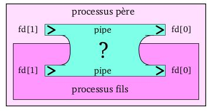
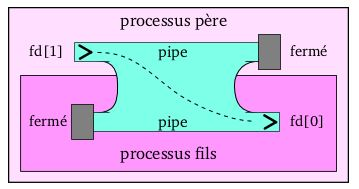

# Programmation Système - Pipes

---

## Définition 

!!! abstract ""
    Les pipes sont des objets permettant l’échange de données entre processus sur **une même machine**.    
    
    Les pipes sont bien connus dans le monde d'Unix. En effet, ils permettent de faire communiquer deux processus entre eux.   
    Ils sont représentés par le caractère ``|``.   
    On les utilisent courrament dans les terminaux pour rediriger la sortie d'une commande vers l'entré d'une autre commande, par exemple : ""ls | wc"".   
    
    Mais nous avons les mêmes possibilités dans un programme en langage C, ou ces pipes seront gérés comme des fichiers.
    Les lectures/écritures dans un pipe se font avec les fonctions ``read()`` et ``write()`` classiques.  
    
    Il existe **deux** types de pipes en `C` :  
    - Anonymes  
    - Nommés    
    
---

## Echanges

### Chronologiques

!!! abstract ""
    Les échanges se font de manière ==**chronologique**==, en **FIFO** : les données lues sont celles écrites depuis le plus longtemps.  
    
    

!!! warning ""
    Les lectures sont ==**destructrices**== !
    
    
### Atomiques

!!! abstract ""
    Les échanges se font de manière ==**atomique**== : si 2 tâches écrivent dans un même pipe respectivement ``m`` et ``n`` octets en "même temps" ces octets restent disjoints.  
    
    
    
### Synchronisés

!!! abstract ""
    Les échanges se font de manière ==**synchronisés**== :  
    
    - une tâche qui veut lire dans un pipe **vide** est suspendue jusqu’à l’écriture d’octets  
    - une tâche qui veut ouvrir en lecture un pipe qui n’est pas déjà ouvert en écriture est suspendue  
    - une tâche qui veut ouvrir en écriture un pipe qui n’est pas déjà ouvert en lecture est suspendue  
    - une tâche qui veut lire dans un pipe vide qui n’est plus ouvert en écriture reçoit le compte-rendu "fin de fichier"
    

### Pipe dans un processus unique

!!! abstract ""
    Créer un pipe dans un processus unique n'a pas beaucoup d'interêt mais cela nous permet de comprendre ce qui caractérise un pipe :  
    
    Un pipe possède **deux** extremités.
    Il n'est possible de faire passer des informations que dans un **sens unique**.   
    On peut donc écrire des informations à l'entré et en lire à la sortie.
    Les deux extrémités sont référencés par des **descripteurs de fichiers** (des entiers stockés dans la variable fd).

    

---

### Pipe entre un processus et son fils

!!! abstract ""
    La différence avec l'exemple précedent est que, en plus de créer un pipe, notre processus cré un fils.   
    Le pipe est alors automatiquement partagé entre le père et le fils.   
    Si l'un écrit dans le pipe alors on ne sait pas lequel des deux va recevoir l'information.   
    Ceci peut donner des résultats inattendus.
    
    
    
    Pour être certain de qui va écrire et qui va lire dans le pipe, il faut que les processus ==**ferment les extrémités qu'ils n'utilisent pas**==.  
    
    
    
    De cette façon le processus père peut être certain que s'il écrit dans le pipe (``fd[1]``), le fils va reçevoir l'information en lecture (``fd[0]``).   


!!! warning ""
    Si l'on souhaite échanger des informations dans l'autre sens il faut créer **un deuxième pipe** et l'initialiser dans l'autre sens. 
    
    
---

## Pipe Anonymes

!!! abstract ""
    C'est un objet **sans nom**, et n'est donc pas un fichier stocké sur disque de manière permanente.  
    Il n'est connu que par les processus de même filiation.  
    
    Il possède :  
    - 2 descripteurs: lecture / écriture stockés dans un tableau  
    - 2 pointeurs automatiques: lecture / écriture
    
    ^^Caractéristiques^^ :  
    - L’ouverture se fait au moment de la création par ``pipe()`` et non par ``open()``  
    - Taille limitée  
    - Le 1er qui lit récupère les données  

!!! warning ""
    La fonction ``lseek()`` est **non utilisable** !
   
### Creation 
 
```c linenums="1"
int pipe( int desc[2] );

– desc[0] : descripteur de lecture
– desc[1] : descripteur d’écriture  

– Résultat : 0 si création du pipe, -1 sinon
``` 

### Exemple

```c linenums="1" hl_lines="7 12 13 14 17 18 20"
int main(void)
{
    int desc[2];
    int pid;
    char buf[7];
    
    pipe(desc);                         // Création et ouverture du pipe
    
    pid = fork();

    if (pid == 0) {
        close(desc[0]);                 // Fermeture du pipe en lecture
        write(desc[1], "coucou" ,7);    // Ecriture dans le pipe
        close(desc[1]);                 // Fermeture du pipe en écriture
        exit(0);
    } else {
        close(desc[1]);                 // Fermeture du pipe en écriture
        read(desc[0], buf,7);           // Lecture dans le pipe
        wait(NULL);
        close(desc[0]);                 // Fermeture du pipe en lecture
    }
}
``` 

---

## Pipe Nommés

!!! abstract ""
    Cette fois-ci c'est un **fichier spécial** de type pipe,  référencé par un chemin dans l’arborescence (porte un nom et persiste après la mort des processus).  
    Il permet donc la communication entre deux processus s’exécutant sur la même machine sans forcément qu'ils aient une filiation directe.  
    
    Ils possèdent un seul descripteur par ouverture.  
    
!!! warning ""
    Pointeurs automatiques: ``lseek()`` **non utilisable** !
    

### Creation 
    
```c linenums="1"
int mkfifo (char *ref, int mode);

– ref :  nom du pipe
– mode : droits d’accès

Resultat : 0 si création, -1 sinon.
```

!!! tip ""
    Les pipe nommés peuvent être créés en utilisant la commande unix: mkfifo
    
### Ouverture

```c linenums="1"
int open( char *path, int mode); 

– path : chemin d’accès au fichier
– mode : mode d’ouverture
    • O_RDONLY
    • O_WRONLY
    • O_RDWR

Résultat : descripteur de fichier du pipe
```

### Fermeture

```c linenums="1"
int close (int desc);

– desc : descripteur de fichier

Résultat : -1 en cas d’echec, 0 sinon
```

### Destruction

```c linenums="1"
int unlink (char *ref);

– ref : nom du pipe

Résultat : -1 en cas d’echec, 0 sinon
```

!!! tip ""
    Cela correspond à ``rm ref``  sous unix !

### Exemple

<table border="0">
<tr>
    <td>
        Programme principal :
    </td> 
    <td>
        Programme fils :
    </td>
</tr>

<tr>
    <td>
        ```c hl_lines="6 7 12 13 16"
        #include <fcntl.h>
        int main(void)
        {
            int pid,desc,nb ;
            char buf[80];
            unlink(" pipe ");
            mkfifo("pipe« ,0666);
            pid=fork();
            if(pid = = 0)
                execv("fille", NULL);
        
            desc=open("pipe",O_RDONLY);
            nb=read(desc,buf,80);
            buf[nb]=‘\0 ’;
            printf(" message: %s\n ",buf);
            close(desc);
            wait(NULL);
          exit(0);
        }
        ```
    </td>
    <td>
        ```c hl_lines="7 8 9"
        #include<fcntl.h>
        #include<sys/mode.h>
        int main(void)
        {
            int dp;
            sleep(8);
            dp=open("pipe",O_WRONLY);
            write(dp, "coucou ",7) ;
            close(dp);
          exit(0);
        }
        ```
    </td>
</tr>
</table>