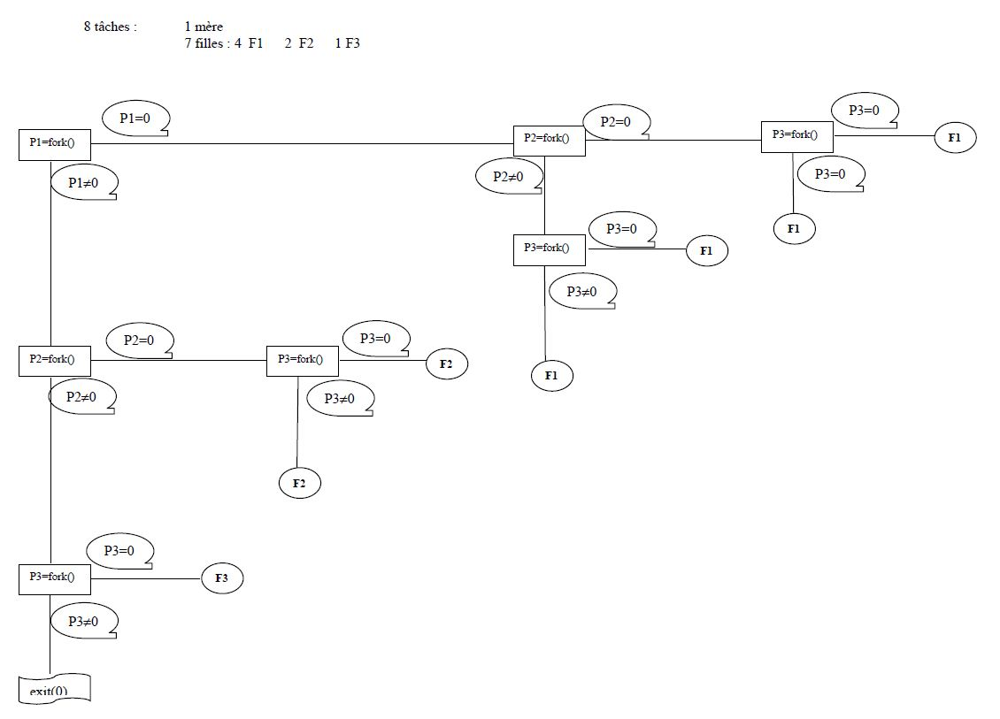

# Programmation Système : TP2 - Processus

---

## Sur Papier

### Exercice 1 : Arbre généalogique

On a le code suivant :

```c linenums="1"
#include <stdio.h>
#include <unistd.h>
#include <stdlib.h>

int main()
{
	int p1,p2,p3;
	p1=p2=p3=-1;
	p1=fork();
	p2=fork();
	p3=fork();
	if(p1==0)
		execv("F1",NULL);
	if(p2==0)
		execv("F2",NULL); 
	if(p3==0)
		execv("F3",NULL);
    pause();
	exit(0);
}
```

1. Combien de processus s'executent ?
1. Sur quels programmes (Père, F1, F2 et F3) ?

Justifiez vos réponses en dessinant un arbre généalogique.




### Exercice 2 : Lecture de code

On suppose que le pid du père est 100 et celui du fils 200, quelles sont les valeurs affichées par le programme ci-dessous ?  

```c linenums="1"
#include <stdio.h>
#include <unistd.h>
#include <stdlib.h>

int main(void)
{
	int pid;
	int x = 0;
	x++;
	printf(" mon pid est %d x = %d \n",getpid(),x);
	pid = fork();
	if(pid == 0)
	{
		x++;
		printf(" mon pid est %d x = %d \n", getpid(), x );
	} else
		printf(" mon pid est %d x = %d \n", getpid(), x ); 
	printf(" mon pid est %d x = %d \n", getpid(), x );
}
```

??? example "Solution"

    ```bash linenums="1"
    mon pid est 100 x = 1
    mon pid est 200 x = 2
    mon pid est 200 x = 2
    mon pid est 100 x = 1
    mon pid est 100 x = 1
    ```
    
    !!! warning ""
        L'ordre d'affichage peut chnager selon l'orde de passage de processus ! Cela dépends du timing, de l'algo d'ordonnacement en vigueur etc ...
        

---

## A coder !

### Exercice 3 : fork()

Dans **un même programme**, un processus en active un autre et se met en attente de la fin de celui-ci, récupère le **mot d’état** (valeur retournée par *exit()*) transmis et l’affiche.  

Chacun des processus affiche son PID et celui de son père.  
Le père affiche en plus le PID de son fils.  

??? example "Solution"
    
    ```c linenums="1"
    #include <stdio.h>
    #include <unistd.h>
    #include <stdlib.h>
    
    int main(void)
    {
        int pid;
        int status;
        
        pid = fork();
        
        if(pid == 0)
        {
            printf(" FILS : mon pid est %d \n", getpid());
            printf(" FILS : mon ppid est %d \n", getppid());
            exit(10);
        }else{
            printf("PERE : mon pid est %d \n", getpid()); 
            printf("PERE : mon ppid est %d \n", getppid() );
            printf ("PERE: mon fils est %d", pid); 
            wait(&status);
            printf("\n PERE status :  %d",status>>8);
        }
        
    return 0;
    }

    ```  


### Exercice 4 : execv()

Un processus (programme P) en active **un autre** F en lui transmettant une chaine de caractères saisie au clavier.  

- **F** calcule la longueur de la chaine et la transmet **comme mot d’état** à **P**.  
- **P** affiche la longueur.

??? example "Solution"

    Père :
    
    ```c linenums="1"
    #include <stdio.h>
    #include <unistd.h>
    #include <stdlib.h>
    
    int main(void)
    {
        int pid;
        int stat;
        char message [100];
        int longueur;
        char * argv [3];
        argv[0] = "F";
        argv[2]= NULL;
    
        printf("Entrez une chaine de caractere : ");
        scanf("%s",message);
        pid = fork();
        argv[1]= message;
        
        if(pid == 0)
        {
            printf(" FILS : mon pid est %d \n", getpid());
            printf(" FILS : mon ppid est %d \n", getppid());
            execv("F",argv);
        }else{
            printf("PERE : mon pid est %d \n", getpid()); 
            printf("PERE : mon ppid est %d \n", getppid() );
            printf ("PERE: mon fils est %d", pid); 
            wait(&stat);
            printf("\n PERE status == longueur message :  %d",stat>>8);
        }
        
    return 0;
    }

    ```
    
    Fils :
    
    ```c linenums="1"
    #include <stdio.h>
    #include <unistd.h>
    #include <stdlib.h>
    
    int main(int argc,char *argv[])
    {
        int cpt = 0;
        char * mess;
        mess = argv[1];
        while (mess[cpt] != '\0'){
            cpt ++;
        }
        printf("FILS : La chaine fait %d \n ", cpt);
        
      exit(cpt);
    }
    ```    

